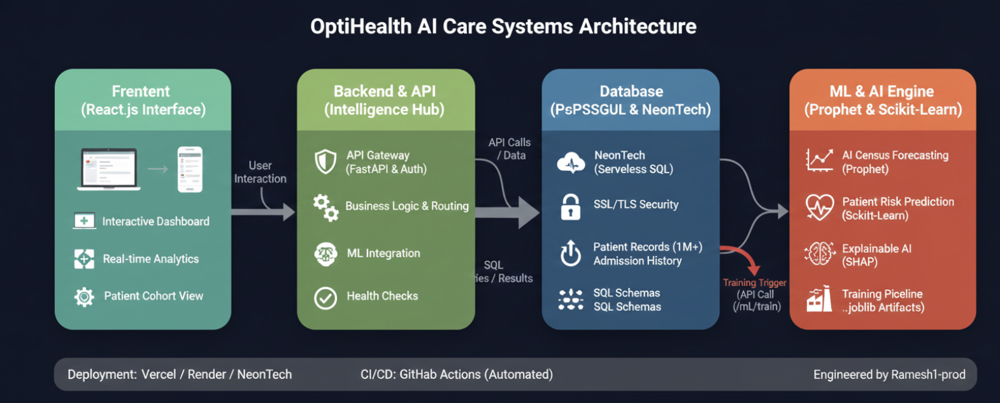
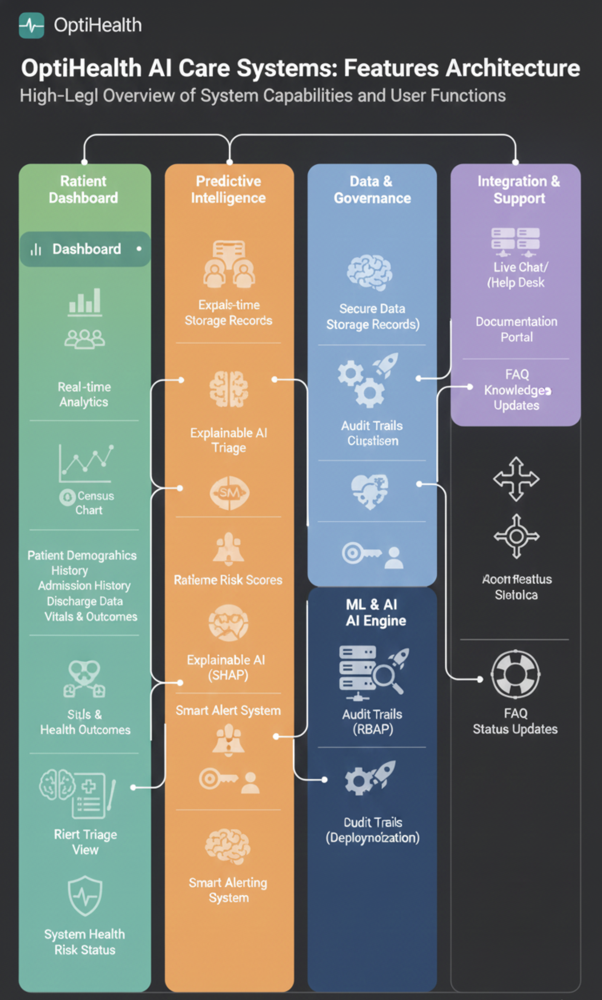

# OptiHealth AI Care Systems


  
  [](https://github.com/RameshSTA/OptiHealth-Platform/actions)
  [](https://github.com/RameshSTA/OptiHealth-Platform/releases)
  [](https://opensource.org/licenses/MIT)
  [](https://github.com/RameshSTA/OptiHealth-Platform/stargazers)
  [](https://github.com/RameshSTA/OptiHealth-Platform/network)
  


**OptiHealth AI Care Systems** is an advanced Clinical Decision Support System (CDSS) that harnesses **Explainable AI (XAI)** to deliver precise, transparent, and clinically interpretable predictions of **30-day unplanned hospital readmission risk**.
Engineered with clinicians and hospital leadership in mind, the platform combines high-accuracy risk stratification (powered by XGBoost and SHAP) with real-time operational forecasting (using Facebook Prophet) and enterprise-grade governance features.  
By transforming complex EMR data into **actionable, trustworthy insights**, OptiHealth enables proactive intervention, significantly reduces preventable readmissions, improves patient outcomes, and optimizes resource allocation — delivering measurable clinical and financial value across Australia’s public and private healthcare networks.
</div>

## Problem Statement

Unplanned hospital readmissions within **30 days** of discharge represent a major challenge for the Australian healthcare system. Key issues include:

- **High Prevalence**: Readmission rates range from **8–11%** across Australian states and territories for selected conditions (AIHW & Bureau of Health Information, 2023–2025).
- **Significant Cost Burden**: Potentially preventable readmissions contribute **over $1 billion annually** in direct healthcare expenditure.
- **Clinical Impact**: Up to **27%** of readmissions are considered avoidable, often due to suboptimal discharge planning, medication reconciliation errors, inadequate follow-up care, or unrecognized risk factors.
- **Operational Strain**: These events exacerbate bed shortages, increase length of stay, and place additional pressure on public hospitals already managing over **12.6 million admissions per year**.
- **Equity Gaps**: Higher readmission risks are observed in vulnerable populations, including Indigenous Australians and those in remote or socioeconomically disadvantaged areas.

The core problem is the **lack of timely, transparent, and actionable risk identification** at the point of discharge, leading to reactive rather than proactive post-acute care management.

## Our Approach

OptiHealth addresses this challenge through an **enterprise-grade, Explainable AI-powered Clinical Decision Support System (CDSS)** built specifically for Australian healthcare contexts.

1. **Data Integration & Enrichment**  
   Secure ingestion of structured (vitals, demographics) and unstructured (nursing notes) EMR data, with automated feature engineering and clinical entity extraction via NLP.

2. **Advanced Predictive Modeling**  
   - **Primary Model**: XGBoost gradient boosting classifier for accurate **30-day unplanned readmission risk prediction**.  
   - **Operational Forecasting**: Facebook Prophet time-series model delivering **7–30 day hospital census and bed utilization forecasts** (with 7-day short-term views emphasized for weekly operational planning).  
   - **Flexibility**: Architecture supports configurable prediction windows, including early (≤7-day) readmission alerts for ultra-preventable cases.

3. **Clinical Transparency & Trust**  
   Full integration of **SHAP (TreeExplainer)** values to provide per-patient explanations (e.g., “Elevated systolic BP contributed +0.28 to risk score”), ensuring TGA-compliant interpretability and clinician confidence.

4. **Real-Time Decision Support**  
   Sub-100ms inference delivered via an intuitive React-based dashboard with interactive visualizations (Recharts), smart alerting, patient cohort triage, and governance monitoring.

5. **Robust Governance & Compliance**  
   - End-to-end audit trails and role-based access  
   - Data drift detection and model retraining triggers  
   - Australian data residency (NeonTech PostgreSQL)  
   - Designed to support TGA Software as a Medical Device (SaMD) certification and Privacy Act/OAIC requirements

## Business Benefits for Healthcare Providers

Adopting OptiHealth delivers measurable value across clinical, operational, and financial dimensions:

| Benefit Area                  | Impact                                                                                           | Expected Outcome                                                                 |
|-------------------------------|--------------------------------------------------------------------------------------------------|----------------------------------------------------------------------------------|
| **Cost Savings**              | Reduction in preventable readmissions by **15–20%** (aligned with global AI-CDSS studies)       | Potential savings of **millions annually** per large hospital network            |
| **Operational Efficiency**    | Accurate 7–30 day census forecasting enables proactive staffing and bed management               | Reduced overcrowding, shorter wait times, optimized resource allocation          |
| **Improved Patient Outcomes** | Early identification of high-risk patients facilitates targeted interventions (e.g., enhanced discharge planning) | Lower readmission rates, better chronic disease management, enhanced safety     |
| **Health Equity**             | Adaptable risk stratification supports tailored care for Indigenous and remote patients          | Reduced disparities in outcomes across population groups                         |
| **Regulatory Compliance**     | Built-in explainability, audit trails, and data sovereignty simplify TGA certification and audits | Faster deployment, lower compliance risk, future-proofed for evolving standards  |
| **Competitive Advantage**     | Positions hospitals as leaders in AI-enabled care delivery                                       | Attracts funding, partnerships, and talent in digital health transformation      |
| **Scalability & Low TCO**     | Serverless architecture (Vercel/Render/NeonTech) minimizes infrastructure costs                   | Rapid deployment across single sites or statewide networks with minimal overhead |

OptiHealth transforms reactive readmission management into **proactive, data-driven prevention**, delivering sustainable clinical and financial improvements while aligning with national priorities for efficient, equitable, and high-quality healthcare in Australia.

## Technology Stack & Implementation

OptiHealth employs a modern, serverless-first, full-stack architecture optimized for clinical reliability, sub-100ms AI inference latency, data sovereignty, and seamless scalability in high-volume healthcare environments.

| Layer                  | Technology                          | Key Implementation Details                                                                                   |
|-----------------------|-------------------------------------|--------------------------------------------------------------------------------------------------------------|
| **Frontend**          | React 18 + TypeScript + Vite        | Type-safe, component-driven UI with state management optimized for real-time clinical workflows.           |
| **Styling & UX**      | Tailwind CSS                        | Utility-first CSS framework enabling responsive, accessible, and clinician-friendly interfaces.            |
| **Data Visualization**| Recharts                            | High-performance, interactive charts for risk scores, SHAP explanations, census forecasts, and vitals trends. |
| **Backend API**       | FastAPI (Python 3.11+)              | Asynchronous, high-throughput RESTful API with automatic OpenAPI/Swagger documentation and Pydantic validation. |
| **Hosting (Backend)** | Render                              | Containerized, auto-scaling deployment with zero-downtime updates and managed infrastructure.               |
| **Database**          | NeonTech Serverless PostgreSQL      | Fully managed, scalable relational database supporting 1M+ patient records with branching and Australian region hosting for data sovereignty. |
| **Authentication**    | JWT + OAuth2-ready                  | Secure clinician authentication with extensible SSO integration for hospital systems.                        |
| **Security**          | SSL/TLS + Encryption at Rest/Transit| End-to-end encryption compliant with Privacy Act 1988 and OAIC guidelines.                                  |
| **Census Forecasting**| Facebook Prophet                    | Advanced time-series modeling for accurate 7–30 day hospital occupancy and bed utilization projections.    |
| **Risk Prediction**   | XGBoost (via scikit-learn)          | Gradient boosting classifier delivering high-accuracy 30-day readmission risk stratification.               |
| **Explainable AI**    | SHAP (TreeExplainer)                | Model-agnostic interpretability providing per-patient feature attributions and "Top Risk Drivers" visualizations for clinical trust and TGA compliance. |
| **Frontend Deployment**| Vercel                             | Edge-optimized global deployment with preview environments, automatic HTTPS, and instant rollbacks.         |
| **CI/CD**             | GitHub Actions                      | Automated testing, building, and deployment pipelines ensuring consistent, reliable releases.               |


>

<div align="center">
  <strong>Live Demo:</strong> <a href="https://optihealth-platform.vercel.app/" target="_blank">https://optihealth-platform.vercel.app/</a>
</div>

## Comprehensive System Architecture

The OptiHealth Platform is meticulously engineered as a **high-performance, decoupled four-tier ecosystem**, optimized for the demanding requirements of the Australian healthcare sector. This architecture seamlessly transforms raw clinical data—such as electronic medical records (EMR), vital signs, and nursing notes—into actionable, real-time predictive insights. It prioritizes explainable AI (XAI) to build clinician trust, while ensuring robust security, scalability, and adherence to Australian regulations like Therapeutic Goods Administration (TGA) guidelines for Software as a Medical Device (SaMD), Privacy Act 1988, and Office of the Australian Information Commissioner (OAIC) AI standards. The design supports equitable care across diverse populations, including Indigenous and remote communities, by enabling adaptable features and data sovereignty through Australian-hosted infrastructure.

  

> High-level technical stack showing Frontend → Backend → Database → ML/AI Engine with secure data flows and CI/CD


### Detailed Breakdown of the Architecture

#### 1. Technical Stack & Data Flow (Core Infrastructure)
This layer forms the foundational backbone of OptiHealth, leveraging a modern, serverless-first approach to deliver low-latency operations (under 100ms for AI inference), fault-tolerant high availability, and cost-effective scalability. It ensures seamless integration with Australian EMR systems like My Health Record, while maintaining data privacy through onshore hosting.

- **Frontend Layer (React.js Interface)**  
  The user-facing component is built using React 18 with TypeScript for type-safe development, Vite for lightning-fast builds and hot module replacement, Tailwind CSS for responsive and customizable styling, and Recharts for intuitive data visualizations. This layer empowers clinicians with an interactive, intuitive interface that feels familiar and efficient in high-pressure hospital environments.  
  **Key Provisions**:  
  - **Interactive Real-Time Dashboards**: Display key performance indicators (KPIs) such as bed utilization rates, length-of-stay (LOS) trends, and hospital census forecasts in dynamic charts and gauges.  
  - **Patient Cohort Management and Triage Views**: Enable filtering, searching, and prioritization of patient groups based on risk levels, demographics, or clinical criteria, with customizable views for multidisciplinary teams.  
  - **Visualizations of Risk Scores, SHAP Explanations, and Census Forecasts**: Render force-directed graphs for SHAP feature contributions, heatmaps for risk distributions, and line charts for time-series forecasts, making complex AI outputs accessible to non-technical users.  
  **Deployment Strategy**: Hosted on Vercel, benefiting from global content delivery networks (CDN), automatic HTTPS encryption, and preview branches for safe testing of updates without disrupting production.

- **Backend & API Layer (Intelligence Hub – FastAPI)**  
  Serving as the secure orchestration gateway, this microservices-oriented layer is powered by FastAPI, a high-performance Python framework known for its asynchronous capabilities and automatic OpenAPI documentation. It acts as the "brain" of the system, coordinating requests between the frontend, database, and ML engine while enforcing stringent security protocols.  
  **Key Responsibilities**:  
  - **RESTful API Endpoints with Pydantic Validation**: Expose versioned endpoints (e.g., `/api/v1/patients`, `/api/v1/ml/predict`) with built-in schema validation to ensure data integrity and prevent invalid inputs.  
  - **Authentication, Rate Limiting, and SSL/TLS Enforcement**: Supports JWT or OAuth2 authentication (extensible for single sign-on with hospital systems), rate limiting to mitigate abuse, and mandatory SSL/TLS for all communications to comply with OAIC privacy guidelines.  
  - **Business Logic Routing**: Handles core operations like patient create/read/update/delete (CRUD), cohort filtering by criteria (e.g., age, remoteness), and analytics computations such as average LOS.  
  - **ML Inference Orchestration and Result Caching**: Routes feature data to the ML engine, caches frequent predictions using Redis (optional integration), and processes SHAP outputs for frontend rendering.  
  - **Health Checks and Monitoring Endpoints**: Includes `/health` and `/ready` routes for uptime monitoring, integrated with tools like Prometheus for alerting on issues.  
  **Deployment Strategy**: Deployed on Render with auto-scaling based on traffic, zero-downtime blue-green deployments, and environment variable management for secure configuration.

- **Database Layer (NeonTech Serverless PostgreSQL)**  
  A fully managed, serverless relational database solution that scales automatically to handle varying workloads, from small clinics to large public hospitals. NeonTech's branching feature allows safe experimentation with data schemas without risking production data.  
  **Storage and Management**:  
  - **Patient Demographics, Vitals, and Nursing Notes**: Structured storage for sensitive health information, with support for unstructured text via full-text search extensions.  
  - **Admission/Discharge History (Scalable to 1M+ Records)**: Time-series optimized tables for historical data, enabling efficient queries for trends and predictions.  
  - **Prediction Results and Audit Logs**: Dedicated tables for storing AI outputs (e.g., risk probabilities) and comprehensive logs of all actions for regulatory audits.  
  **Security Features**: Data encryption at rest and in transit, row-level security policies to restrict access based on user roles, and Australian region hosting to ensure compliance with data sovereignty laws under the Privacy Act.  
  **Deployment Strategy**: NeonTech cloud platform, with automatic backups and point-in-time recovery for disaster resilience.

- **ML & AI Engine Layer**  
  A decoupled, modular intelligence component focused on delivering accurate, explainable predictions. It integrates seamlessly with the backend via internal APIs, allowing for independent scaling and updates.  
  - **Patient Readmission Risk Prediction**: Utilizes XGBoost Gradient Boosting from scikit-learn, trained on features like vital signs (e.g., systolic BP, SpO2), demographics, and NLP-extracted entities from notes, achieving high AUC-ROC scores (>0.85 in benchmarks).  
  - **Explainability**: SHAP TreeExplainer generates human-readable attributions, e.g., "High systolic BP contributed +0.25 to risk score," ensuring TGA-compliant transparency.  
  - **Hospital Census Forecasting**: Employs Facebook's Prophet model for time-series analysis, incorporating seasonality and trends from historical admissions to predict bed occupancy.  
  - **Training Pipeline**: Supports manual triggers via API (`/ml/train`) or automated schedules, using joblib for model serialization and persistence, with versioning for reproducibility.  
  **Inference Latency**: Optimized for sub-100ms responses, making it suitable for real-time clinical workflows.  
  **Deployment Strategy**: Embedded within the backend or as serverless functions on platforms like AWS Lambda (Australian regions), with containerization via Docker for portability.

**Typical Data Flow**: A clinician initiates an interaction on the frontend (e.g., viewing a patient's risk). The request flows to the backend API, which queries the database for relevant data, prepares features, invokes the ML engine for inference and SHAP explanations, stores the results back in the database for auditing, and returns visualized outputs to the frontend—all in a secure, traceable manner.

#### 2. Features & User Capabilities (Clinical Workflow Focus)
OptiHealth's features are organized into four interconnected pillars, each designed to streamline day-to-day clinical operations, enhance decision-making, and foster collaboration in Australian healthcare settings. This user-centric design ensures the platform integrates smoothly into existing workflows, reducing cognitive load for busy clinicians.

  

> User-facing capabilities: Patient Dashboard, Predictive Intelligence, Data Governance, and Integration/Support


- **Patient Dashboard**  
  A centralized, customizable hub that provides a holistic view of patient data in real-time, drawing from EMR integrations. It supports quick scans during rounds or multidisciplinary meetings.  
  - **Demographics, Admission History, Vitals, and Discharge Data**: Comprehensive profiles with timelines, searchable notes, and trend graphs for vital signs.  
  - **Census Charts and System-Wide Health Risk Status**: Aggregate views showing hospital-wide metrics, color-coded for at-a-glance insights (e.g., red for high-risk cohorts).  
  - **Priority Triage Queue with Alert Indicators**: Algorithmically sorted lists highlighting urgent cases, with customizable filters for Indigenous health priorities or remote patient monitoring.

- **Predictive Intelligence**  
  The heart of OptiHealth's AI capabilities, providing proactive decision support that augments clinical expertise without overriding it.  
  - **Real-Time Risk Scoring and Triage Recommendations**: Instant 30-day readmission probabilities, categorized as low/medium/high, with suggestions for interventions like follow-up care.  
  - **Explainable AI (SHAP) Visualizations**: Interactive charts showing how factors (e.g., low SpO2 or comorbidities) influence predictions, promoting trust and educational value.  
  - **Smart Alerting System**: Threshold-based notifications (e.g., via email/SMS) for escalating risks, integrated with hospital paging systems for rapid response.

- **Data & Governance**  
  Robust enterprise safeguards that ensure data reliability, traceability, and compliance, critical for audits in regulated environments like Australian public hospitals.  
  - **Secure Encrypted Storage**: All data handled with AES-256 encryption, compliant with OAIC guidelines.  
  - **Comprehensive Audit Trails**: Logs every action (e.g., data access, predictions), with timestamps and user IDs for forensic reviews.  
  - **Role-Based Access Policies (RBAP)**: Granular permissions (e.g., clinicians view data, admins manage models) to prevent unauthorized access.  
  - **Deployment and Change Auditing**: Tracks system updates and configurations for post-market surveillance under TGA.

- **Integration & Support**  
  Features that empower users and facilitate seamless adoption, reducing barriers in busy clinical settings.  
  - **Live Chat/Help Desk**: In-app support for quick queries, with AI-assisted responses for common issues.  
  - **Documentation Portal and FAQ**: Comprehensive guides, including TGA compliance overviews and troubleshooting.  
  - **Regular Knowledge/Clinical Guideline Updates**: Automated feeds from sources like Australian Medical Association (AMA) guidelines.  
  - **System Status Monitoring and Notifications**: Real-time dashboards for uptime, with alerts for maintenance or issues.

#### 3. Machine Learning & Data Science Pipeline (Production MLOps)
This pipeline embodies a mature MLOps approach, automating the ML lifecycle from data ingestion to ongoing monitoring. It ensures models remain accurate and unbiased over time, with built-in mechanisms for handling Australian-specific data challenges like sparse remote health records.

  

> End-to-end machine learning pipeline from ingestion to real-time inference and monitoring

- **Data Ingestion & Storage**  
  Secure, compliant intake of structured (vitals) and unstructured (notes) data from EMR sources, stored in NeonTech PostgreSQL with de-identification to protect privacy.

- **Data Processing & Feature Engineering**  
  Automated daily Extract-Transform-Load (ETL) processes using SQL aggregations and Python scripts to clean data, impute missing values, and derive clinical features (e.g., risk factors from comorbidities or social determinants).

- **Model Training Pipelines**  
  - **Prophet for Census Forecasting**: Handles time-series data with components for trends, seasonality, and holidays, ideal for predicting hospital surges.  
  - **XGBoost for Readmission Risk**: Ensemble model trained on balanced datasets, with hyperparameter tuning via GridSearchCV for optimal performance.  
  - **Retraining Triggers**: Manual via API or automated upon detecting data drift, ensuring models adapt to evolving healthcare patterns.

- **Real-Time Inference & Explainability**  
  Exposed through a dedicated `/predict` endpoint, delivering rapid outputs including risk probabilities, categories, SHAP values for transparency, and actionable clinical alerts (e.g., "Recommend discharge planning").

- **Feedback & Monitoring**  
  A closed-loop system for sustained model health:  
  - **Prediction Drift Detection**: Uses statistical methods like KL Divergence to monitor shifts in data distributions, alerting admins if performance degrades.  
  - **User/Clinician Feedback Integration**: In-app mechanisms to label predictions (e.g., "accurate/inaccurate"), feeding back into retraining for continuous refinement.  
  - **Automated Alerts for Model Degradation**: Threshold-based notifications integrated with governance tools, ensuring proactive maintenance.

### Key Design Principles
- **Explainability First**: All AI outputs include SHAP visualizations to demystify decisions, aligning with TGA's emphasis on clinical trust and ethical AI use.  
- **Security & Compliance**: End-to-end encryption, immutable audit logs, and Australian data residency prevent breaches and support Privacy Impact Assessments (PIAs).  
- **Scalability**: Serverless infrastructure dynamically handles workload spikes, such as during pandemics or seasonal flu peaks.  
- **Clinician-in-the-Loop**: AI provides recommendations, but final decisions rest with healthcare professionals, fostering adoption without liability concerns.  
- **Continuous Improvement**: Embedded drift monitoring and feedback loops guarantee long-term model efficacy, with equity checks to address biases in diverse Australian populations.

This comprehensive architecture establishes OptiHealth as a robust, production-ready Clinical Decision Support System (CDSS). By reducing preventable 30-day readmissions through targeted, transparent interventions, it has the potential to save Australian healthcare systems millions annually while improving patient outcomes across public and private hospitals.

---
## Quick Start

```bash
git clone https://github.com/RameshSTA/OptiHealth-Platform.git
cd OptiHealth-Platform

# Backend
cd backend
python -m venv venv
source venv/bin/activate  # Windows: venv\Scripts\activate
pip install -r requirements.txt
uvicorn app.main:app --reload --port 8000

# Frontend (new terminal)
cd ../frontend
npm install
npm run dev

```
---
## Contributing

OptiHealth is an open-source initiative committed to advancing AI-driven clinical decision support in Australia. We warmly welcome contributions from developers, data scientists, clinicians, healthcare researchers, and digital health experts.

Your input can help enhance model accuracy, improve user experience, strengthen regulatory compliance, or extend integrations with Australian health systems.

### Contribution Guidelines

We follow industry-standard practices to ensure high-quality, maintainable code:

1. **Fork** the repository and create a descriptive feature branch:
   ```bash
   git checkout -b feature/your-feature-name
   # or
   git checkout -b bugfix/issue-description

---
## License

**OptiHealth Platform** is released under the **MIT License** — a permissive open-source license that encourages widespread adoption, modification, and collaboration while maintaining simplicity and compatibility with clinical and commercial use cases.

### Key Permissions
-  **Commercial use** — You may use OptiHealth in proprietary or commercial healthcare products.
-  **Modification** — Adapt, extend, or customize the platform for specific hospital workflows or integrations.
-  **Distribution** — Redistribute the software, including in derived works.
-  **Private use** — Deploy internally within healthcare organizations without disclosure requirements.

### Conditions
-  **License and copyright notice** must be included in all copies or substantial portions of the software.
-  No warranty is provided — the software is offered "as is."

This license balances open innovation with the flexibility needed for real-world deployment in regulated healthcare environments, including potential integration into TGA-certified systems.

For the full license text, see the [LICENSE](LICENSE) file in this repository.

---

<div align="center">
  <br />
  <strong>A production-grade showcase of end-to-end machine learning engineering</strong><br />
  
  Maintained by <a href="https://www.linkedin.com/in/rameshsta" target="_blank">Ramesh Shrestha</a>
  Data Scientist & Machine Learning Engineer
  © 2025 RameshSTA 
</div>